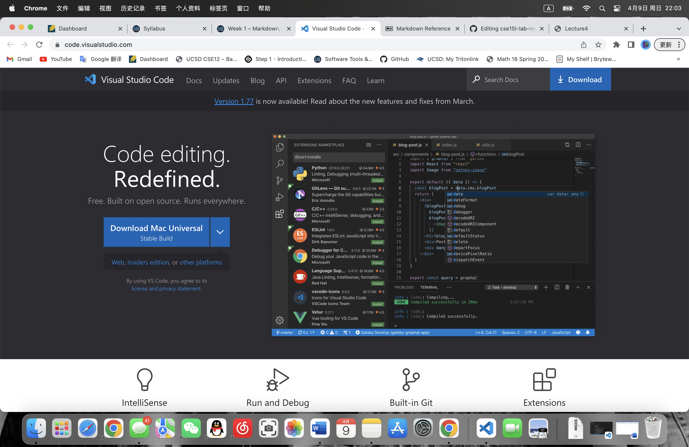

# Remote Access and FileSystem
## Step 1 *Installing VScode*
Go to the link provided here [link](https://code.visualstudio.com/) and follow the instructions on the website to install different versions of VScode on Windows/MacOS.

## Step 2 *Remotely Connecting*

