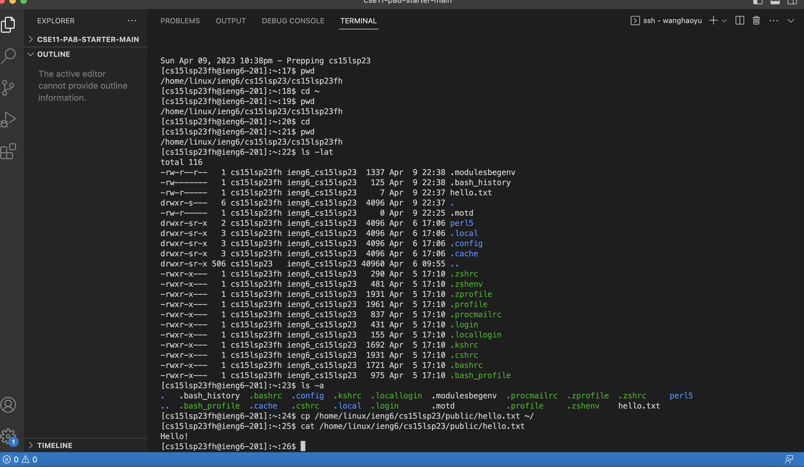

# Remote Access and FileSystem
## Step 1 *Installing VScode*
Go to the link provided here [link](https://code.visualstudio.com/) and follow the instructions on the website to install different versions of VScode on Windows/MacOS.

***
## Step 2 *Remotely Connecting*
* First you need to get your course-specific account here: [link](https://sdacs.ucsd.edu/~icc/index.php). Change the password following instructions on website.
* Open a terminal in VScode (use the Terminal → New Terminal menu option). Then type in `$ ssh cs15lsp23zz@ieng6.ucsd.edu` with the "zz" replaced by your own cse15L course account. When you see messages:
```
The authenticity of host 'ieng6.ucsd.edu (128.54.70.238)' can't be established.
RSA key fingerprint is SHA256:ksruYwhnYH+sySHnHAtLUHngrPEyZTDl/1x99wUQcec.
This key is not known by any other names
Are you sure you want to continue connecting (yes/no/[fingerprint])?
```
Type in "yes" to continue connecting.
* After typing yes, you should be seeing a prompt asking for your password, type in the password of your course-specific account and press enter.
* You are successfully connected if you see this line in your terminal:

    `Hello cs15lsp23fh, you are currently logged into ieng6-201.ucsd.edu`


***
## Step 3 *TryingSomeCommands*
There are a lot of commands that we can use in the terminal, here are some basic ones:
* `cd ~`
* `cd`
* `ls -lat`
* `ls -a`
* `ls <directory>` where `<directory>` is `/home/linux/ieng6/cs15lsp23/cs15lsp23abc`, where the `abc` is one of the other group members’ username
* `cp /home/linux/ieng6/cs15lsp23/public/hello.txt ~/`
* `cat /home/linux/ieng6/cs15lsp23/public/hello.txt`

***


