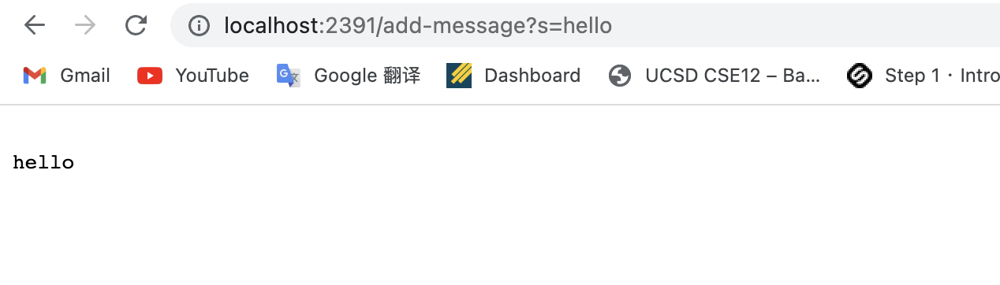

# Remote Access and FileSystem
## Step 1 *Installing VScode*
Go to the link provided here [link](https://code.visualstudio.com/) and follow the instructions on the website to install different versions of VScode on Windows/MacOS.

***
## Step 2 *Remotely Connecting*
* First you need to get your course-specific account here: [link](https://sdacs.ucsd.edu/~icc/index.php). Change the password following instructions on website.
* Open a terminal in VScode (Ctrl or Command + "`", or use the Terminal → New Terminal menu option). Then type in `$ ssh cs15lsp23zz@ieng6.ucsd.edu` with the "zz" replaced by your own cse15L course account.
* 

