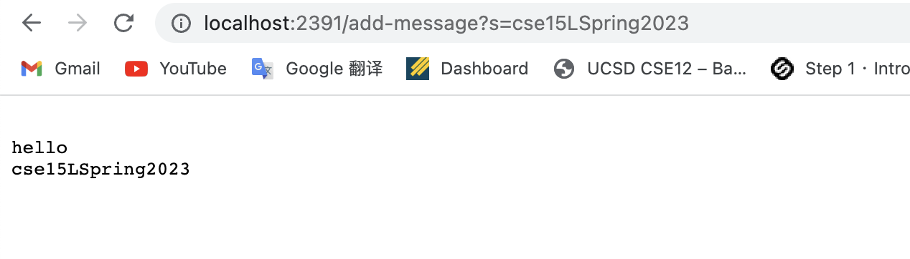

# **Lab Report 2 - Servers and Bugs(Week 3)**

## **Part 1**
* Code for StringServer.java,implemented in the week-2 lab wavelet folder:
```
import java.io.IOException;
import java.net.URI;

class Handler implements URLHandler{
    String message = "";
    public String handleRequest(URI url){
        System.out.println(url);
        if(url.getPath().contains("add-message")){
            String[] parameters = url.getQuery().split("=");
            message = message + "\n" + parameters[1];
        }
        return String.format("%s",message);
    }
}

class StringServer{
    public static void main(String[] args) throws IOException{
        int port = Integer.parseInt(args[0]);
        Server.start(port, new Handler());
    }
}
```

* Screenshot 1: `add-message?s=hello`

    * The main method were first called to create a new url with port number 2391, and the handleRequest method were called to add a string according to         the query provided. 
    * The main method take the argument by looking at the args[0] and create the new url using that argument as port number. The handleRequest method take       the url created in the main method as argument so that we can make changes to the websit using method inside the Handler class. The value of string         message is now "hello"
    * The value of message changed from "" to "hello".

* Screenshot 2" `add-message?s=cse15LSpring2023`

    * The handleRequest method were called to add a String according the query provided.
    * The query method take the argument of the same url as screenshot 1. The value of string message is now "hello\ncse15LSpring2023"
    * The value of message changed from "hello" to "hello\ncse15LSpring2023".

## **Part 2**
*The bug I choose: averageWithoutLowest*

* A failure-inducing input:
  ```
    @Test
    public void test3(){
        double[] input = {2,2,4};
        assertEquals(3,ArrayExamples.averageWithoutLowest(input),0);
    }
  ```
* An input that does not induce a failure:
  ```
    @Test
    public void test4(){
        double[] input = {1,2,4};
        assertEquals(3,ArrayExamples.averageWithoutLowest(input),0);
    }
  ```
* The symptom screenshot:
   

* Code of the older version(with bugs):
    ```
    static double averageWithoutLowest(double[] arr) {
        if(arr.length < 2) { return 0.0; }
        double lowest = arr[0];
        for(double num: arr) {
        if(num < lowest) { lowest = num; }
        }
        double sum = 0;
        for(double num: arr) {
        if(num != lowest) { sum += num; }
        }
        return sum / (arr.length - 1);
        }
    ```

* Fixed code:
    ```
    static double averageWithoutLowest(double[] arr) {
      if(arr.length < 2) { return 0.0; }
      double lowest = arr[0];
      for(double num: arr) {
        if(num < lowest) { lowest = num; }
      }
      double sum = 0;
      for(double num: arr) {
        { sum += num; }
      }
      sum = sum-lowest;
      return sum / (arr.length - 1);
    }
    ```
The older version of bugs first find the lowest number using a for loop and then add up any number which is not equal to the lowest to the sum. However, if there are one or more duplicate lowest number, they will all be left out so that the sum is not correct. The corrected version first add up or the numbers in the array and substract only one occurence of the lowest number, in this way we can get the corrected average value without lowest number.


## **Part 3**
  One thing I learned in the lab is that it is way more efficient to use tests to find bugs. I used to simply look at the code I wrote and try to find       something wrong by comparing it to the assignment requirement. But doing this is time-wasting and not efficient. By completing tasks in this two weeks'   lab, I acknowledged that by implementing some edge tests, we can easily find out what's the difference between actual value and expected value. In this   way, we can find out the potential bugs in our code according to the failure output.
        
   
   
  
  
    


