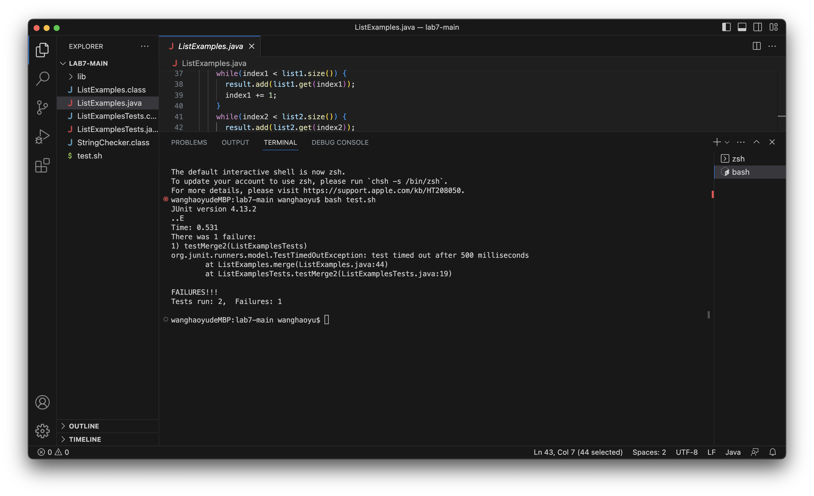
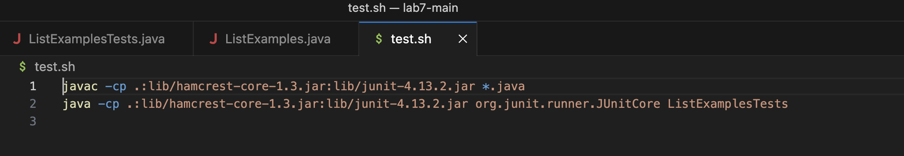
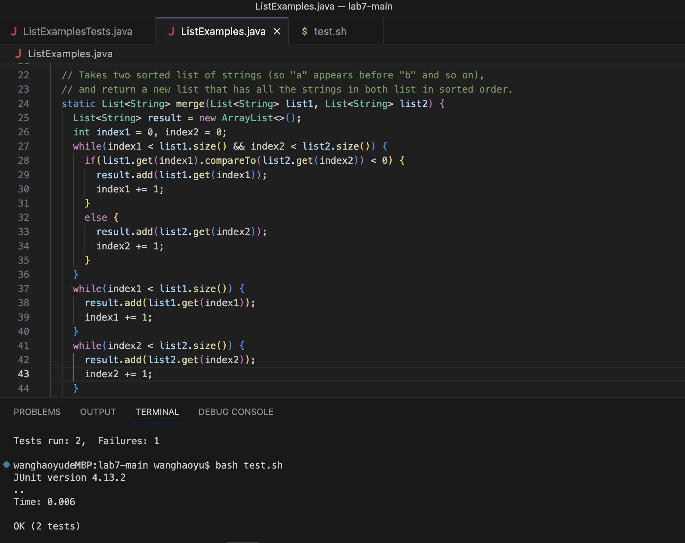

# Lab Report 5-Putting it All Together

# Part1: Debugging Scenario
## Original Post of a Debugging question
**What environment are you using (computer, operating system, web browser, terminal/editor, and so on)?**

Macbook,VScode.

**Detail the symptom you're seeing. Be specific; include both what you're seeing and what you expected to see instead. Screenshots are great, copy-pasted terminal output is also great. Avoid saying “it doesn't work”.**

I am running tests of my ListExamples.java merge method on ListExamplesTests.java . But there was one failure appeared on the terminal about Timeout Exception. 
Here is a screenshot of the output:

**Detail the failure-inducing input and context. That might mean any or all of the command you're running, a test case, command-line arguments, working directory, even the last few commands you ran. Do your best to provide as much context as you can.**

I am testing my merge method implemented in ListExample.java which is supposed to merge two sorted arraylist into one and with an sorted ascending order. I use command "bash test.sh" to run the shell file.
The contents of my shell file is here:


The test output showed an exception instead of an incorrect result, so I think there might be something wrong about my code but I cannot find it.
Here is my code of ListExamples.java and my tests ListExamplesTests.java:


## Response from a TA(mimicking by myself)
*Haoyu Wang: Try changing the index1+=1 in your last while loop to index2+=1.*

## Output after fixing bugs according to TA's suggestion
**Screenshot of output after fixing the bug:**


**Description of the bug:** The third while loop in the original code is trying to add the rest of the remaining elements in list2 into the result arraylist. However, this while loop checks whether index2 is smaller than the size of the arraylist. The original code has a line `index+=1;`, this line is incrementing index1 every time the condition is satisfied. So the while loop runs infinitely since index2 stays the same all the time. Instead of incrementing index1, it should increment index2 by `index2+=1;` so that the code will have correct behaviors.

## Setup Conclusion
* **Directory structure & files:** [Lab7-main](https://github.com/haoyuwang666/lab7)
* **Contents of the file before fixing bugs:**
  
  ListExamples.java:
  ```
  import java.util.ArrayList;
import java.util.List;

interface StringChecker { boolean checkString(String s); }

class ListExamples {

  // Returns a new list that has all the elements of the input list for which
  // the StringChecker returns true, and not the elements that return false, in
  // the same order they appeared in the input list;
  static List<String> filter(List<String> list, StringChecker sc) {
    List<String> result = new ArrayList<>();
    for(String s: list) {
      if(sc.checkString(s)) {
        result.add(0, s);
      }
    }
    return result;
  }
  // Takes two sorted list of strings (so "a" appears before "b" and so on),
  // and return a new list that has all the strings in both list in sorted order.
  static List<String> merge(List<String> list1, List<String> list2) {
    List<String> result = new ArrayList<>();
    int index1 = 0, index2 = 0;
    while(index1 < list1.size() && index2 < list2.size()) {
      if(list1.get(index1).compareTo(list2.get(index2)) < 0) {
        result.add(list1.get(index1));
        index1 += 1;
      }
      else {
        result.add(list2.get(index2));
        index2 += 1;
      }
    }
    while(index1 < list1.size()) {
      result.add(list1.get(index1));
      index1 += 1;
    }
    while(index2 < list2.size()) {
      result.add(list2.get(index2));
      index2 += 1;
    }
    return result;
  }
}
```

ListExamplesTests.java:
```
import static org.junit.Assert.*;
import org.junit.*;
import java.util.*;
import java.util.ArrayList;


public class ListExamplesTests {
	@Test(timeout = 500)
	public void testMerge1() {
    		List<String> l1 = new ArrayList<String>(Arrays.asList("x", "y"));
		List<String> l2 = new ArrayList<String>(Arrays.asList("a", "b"));
		assertArrayEquals(new String[]{ "a", "b", "x", "y"}, ListExamples.merge(l1, l2).toArray());
	}
	
	@Test(timeout = 500)
        public void testMerge2() {
		List<String> l1 = new ArrayList<String>(Arrays.asList("a", "b", "c"));
		List<String> l2 = new ArrayList<String>(Arrays.asList("c", "d", "e"));
		assertArrayEquals(new String[]{ "a", "b", "c", "c", "d", "e" }, ListExamples.merge(l1, l2).toArray());
        }

}
```                                

test.sh:  
``` 
javac -cp .:lib/hamcrest-core-1.3.jar:lib/junit-4.13.2.jar *.java
java -cp .:lib/hamcrest-core-1.3.jar:lib/junit-4.13.2.jar org.junit.runner.JUnitCore ListExamplesTests 
```  
