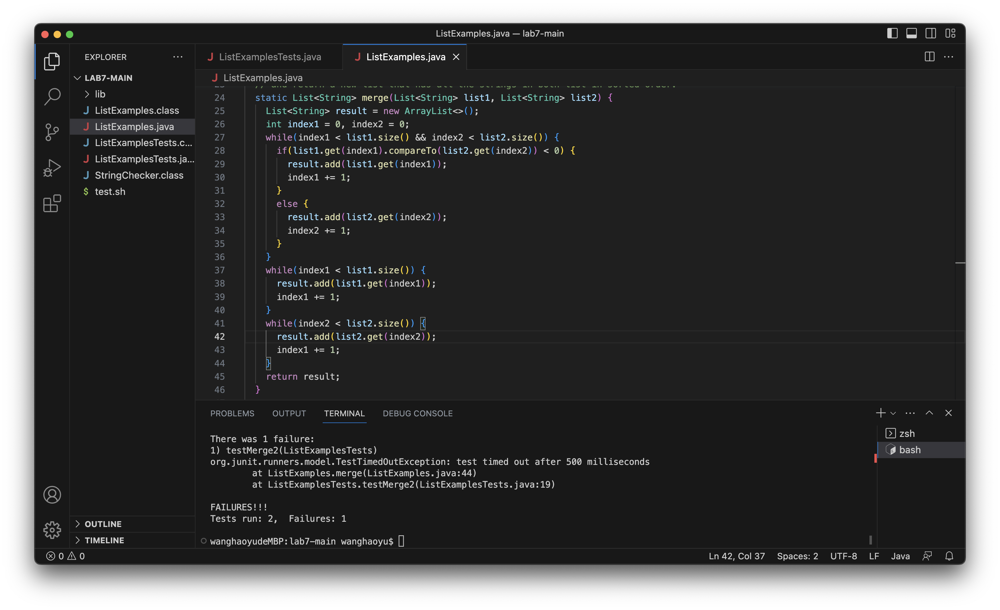
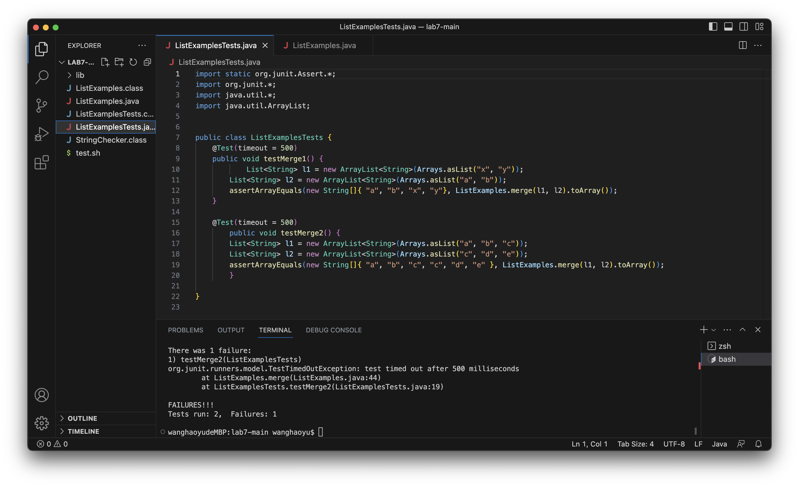

# Lab Report 5-Putting it All Together

# Part1: Debugging Scenario
## Original Post of a Debugging question
**What environment are you using (computer, operating system, web browser, terminal/editor, and so on)?**

Macbook,VScode.

**Detail the symptom you're seeing. Be specific; include both what you're seeing and what you expected to see instead. Screenshots are great, copy-pasted terminal output is also great. Avoid saying “it doesn't work”.**

I am running tests of my ListExamples.java merge method on ListExamplesTests.java . But there was one failure appeared on the terminal about Timeout Exception. 
Here is a screenshot of the output:

**Detail the failure-inducing input and context. That might mean any or all of the command you're running, a test case, command-line arguments, working directory, even the last few commands you ran. Do your best to provide as much context as you can.**

I am testing my merge method implemented in ListExample.java which is supposed to merge two sorted arraylist into one and with an sorted ascending order. I use command "bash test.sh" to run the shell file.
The contents of my shell file is here:


The test output showed an exception instead of an incorrect result, so I think there might be something wrong about my code but I cannot find it.
Here is my code of ListExamples.java and my tests ListExamplesTests.java:



## Response from a TA(mimicking by myself)
*Haoyu Wang: Try changing the index1+=1 in your last while loop to index2+=1.*

## Output after fixing bugs according to TA's suggestion
**Screenshot of output after fixing the bug:**


**Description of the bug:** The third while loop in the original code is trying to add the rest of the remaining elements in list2 into the result arraylist. However, this while loop checks whether index2 is smaller than the size of the arraylist. The original code has a line `index+=1;`, this line is incrementing index1 every time the condition is satisfied. So the while loop runs infinitely since index2 stays the same all the time. Instead of incrementing index1, it should increment index2 by `index2+=1;` so that the code will have correct behaviors.

## Setup Conclusion
* **Directory structure & files:** [Lab7-main](https://github.com/haoyuwang666/lab7)
* **Contents of the file before fixing bugs:** included in the directory structure above.
* **Full command line which triggers the bug:** 
	`bash test.sh`
	with contents of the test.sh shell file:
	```
	javac -cp .:lib/hamcrest-core-1.3.jar:lib/junit-4.13.2.jar *.java
	java -cp .:lib/hamcrest-core-1.3.jar:lib/junit-4.13.2.jar org.junit.runner.JUnitCore ListExamplesTests
	```
* **Description of what to edit to fix the bug:** Change `index+=1` in the last while loop to `index+=2` to properly add elements from list2 to the result arraylist and prevent the loop from running infinite times.


## Part2: Reflection
The most useful thing I learned is about how the gradescope works internally. GradeScope use shell file with some meaningful command lines to run students' code and give scores according to the behavior of their code. I have no ideas of how gradscope tests our code and gives us score before attending lectures and labs (I initially assume insturctors are using some magical commands or they are the ones behind the screen to run our codes manually). Knowing how it actually work give me a sense of how my programming assignments are evaluated and also inspired me on how to create meaningful and effective test cases by myself. It feels great to know the whole process of what happened behind the scenes.

